## Single view metrology

### General Idea
This project is to create 3D texture-mapped models from a single image using the single view modeling method discussed in "Single View Metrology," by Criminisi, Reid, and Zisserman, ICCV 99.

### Reference Paper
[Single View Metrology](https://github.com/jguoaj/single-view-modeling/blob/master/Criminisi99.pdf)

### Methodology
1. calculate the vanishing points by **Bob collins' algorithm**.
2. Calculate the Projective matrix, where the scales are computed with reference points and vanishing points
3. Use Homograph Matrix to get the texture map (for simplicity, we directly "hardcode" points this time)
4. Mark Interesing points and get 3D coordinates

5. Generate VMRL

### Results

#### Example 1, provided sony box
Source Image

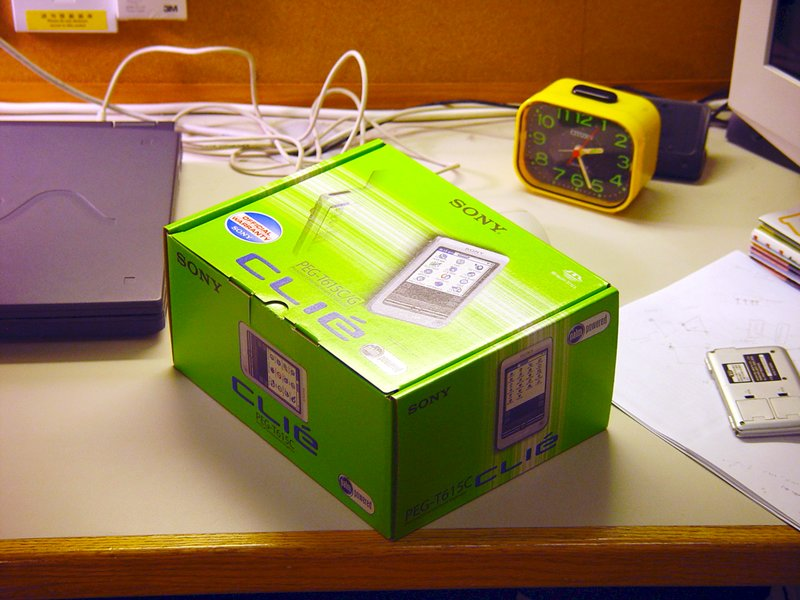

Texture Maps

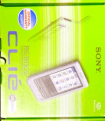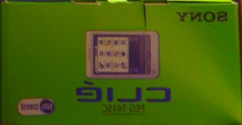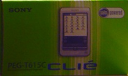

Results

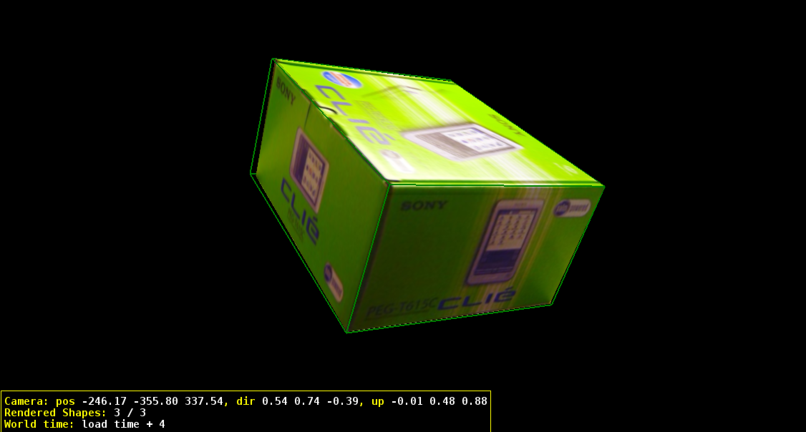

#### Example 2, my own box
Source Image

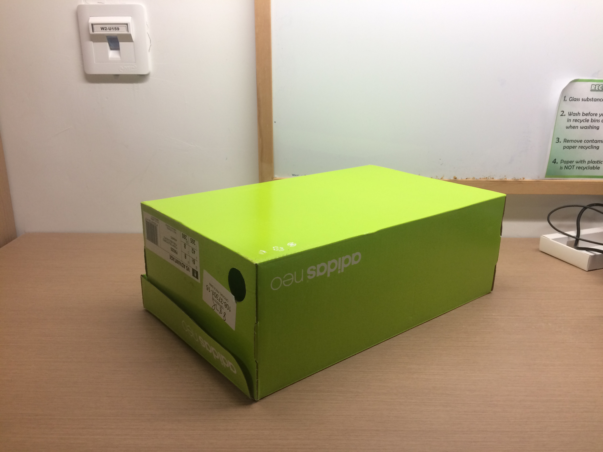

Texture Maps

Results

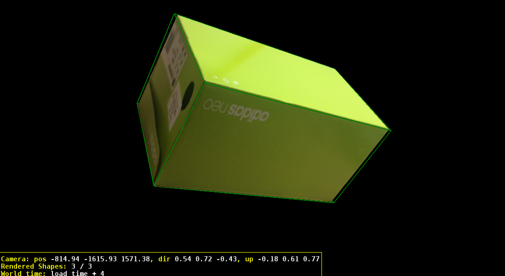

#### Example 3, Rubik's cube
Source Image

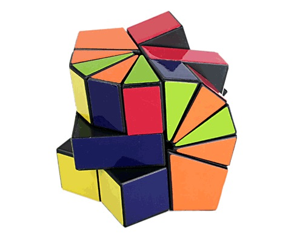

Texture Maps

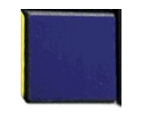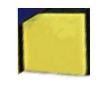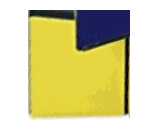
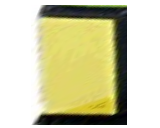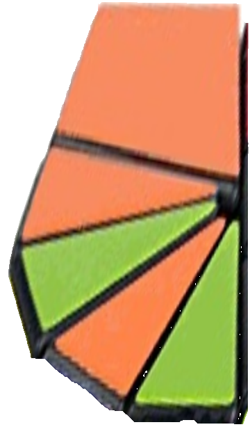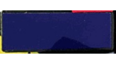

Results

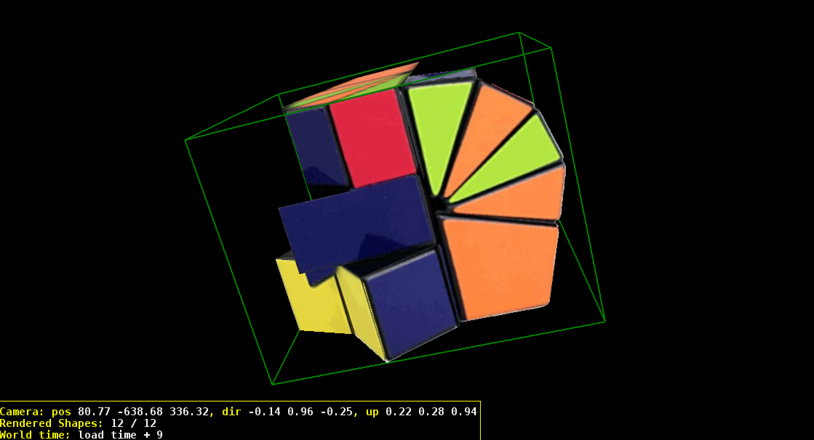

#### Example 4, artistic painting
Source Image

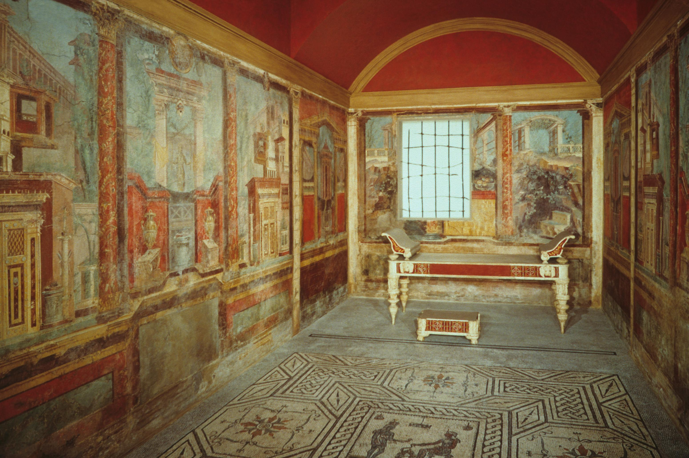

Texture Maps

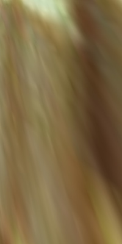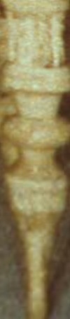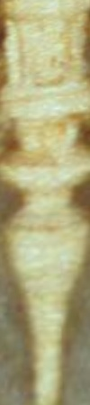
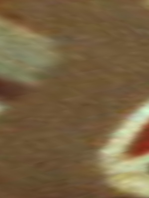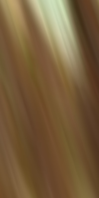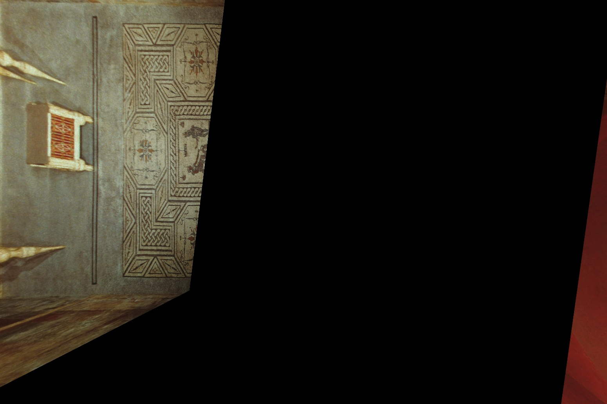

Results

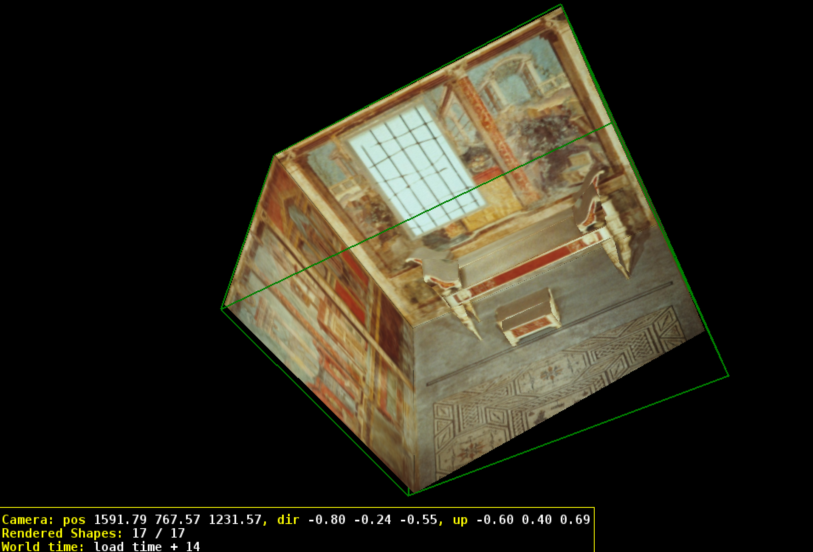

